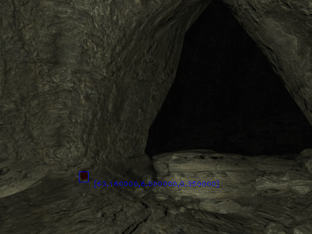
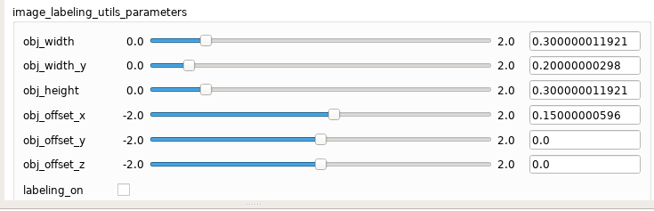

### Image Labeling Utils
This package is developed and used by the MRS group to create a labeled dataset in simulation using ground truth position of the object from gazebo-like simulators.
The 3d position of the object is projected into the camera frame using the camera info topic in ROS format.

## Requirements:
- SDF file of the objects that satisfy the format for parsing it in scripts/artefact_gt_publisher.py. Structure example:
  ```xml
    <include>
      <name>rescue_randy_1</name>
      <uri>https://fuel.ignitionrobotics.org/1.0/OpenRobotics/models/Rescue Randy Sitting</uri>
      <pose>453.290000 183.140000 9.500000 0 0 0.261799</pose>
    </include>
  ```
- in case you need to label a moving object, supply a topic with position of the object, it should be of ``geometry_msgs/PoseStamped``, and remap it in launch file ``~artefact_pose``
- odometry for the vehicle
- the transformation from artifact frame to the frame of the vehicle odometry
- camera info - camera calibration and information from ROS.
- set two variable in .bashrc or .zshrc:
  - ```export ART_NAME="artefact_name_in_gazebo_world"``` - this specifies the artefact name that is parsed from world file (in sdf format for ign gazebo)
  - ``export OBJ_NAME="artefact_name_for_dataset"`` - this variable specifies class name for dataset


## Output:
- The package outputs an image on /UAV_NAME/image_labeling_utils/artefact_boundings

- The bounding box is managed using the ROS rqt_reconfigure plugin, as shown in the picture, it also provides an offset to the artifact position, to suppress the odometry drift of the vehicle

- Using the rqt button "labeling_on" you can turn on image saving. The images are saved to dataset/images/<name_of_the_object>.time/*.png. The labels are saved to  dataset/labels/<name_of_the_object>.time/*.json.
- The label format is presented in two types: [labelme](https://github.com/wkentaro/labelme) and CSV. In each folder, there is a JSON for each image, and a CSV file for the whole directory (containing every frame).
- JSON format is like the following:
   ```json
   {
   "flags" : {},
   "imageData" : null,
   "imageHeight" : 480,
   "imagePath" : "../../images/backpack_5_92.980000/111.340000_0.png",
   "imageWidth" : 640,
   "shapes" : [
      {
         "flags" : {},
         "label" : "backpack",
         "points" : [
            [ 105.52516802928605, 364.03153186411134 ],
            [ 128.28468286033288, 343.0733904960552 ]
         ],
         "shape_type" : "rectangle"
      }
   ],
   "version" : "0.0.1"
  }
  ```

- the csv format is as follows:
  ```
    ../../images/backpack_3_214.968000/230.120000_0.png,x1,y1,x2,y2,obj_name
  ```

## Future TODOs:
- add brightness control - brightness is used to label objects that are in shadow or somewhere far. We had encountered several issues when the object was on the picture but was very dark. Usually, a Deep NN can detect such objects.
- dynamic change of the size using object size and XYZ RPY position, getting rid of the manual width and height params
- read gazebo world file to parse objects

Authors & Contact
-----------------
```
Yurii Stasinchuk <stasiyur@fel.cvut.cz>
Matouš Vrba  <vrbamato@fel.cvut.cz> 
Multi-Robot Systems mrs.felk.cvut.cz
Faculty of electrical engineering,
Czech Technical University in Prague
```
